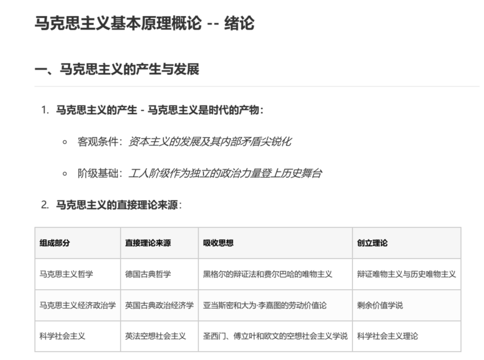
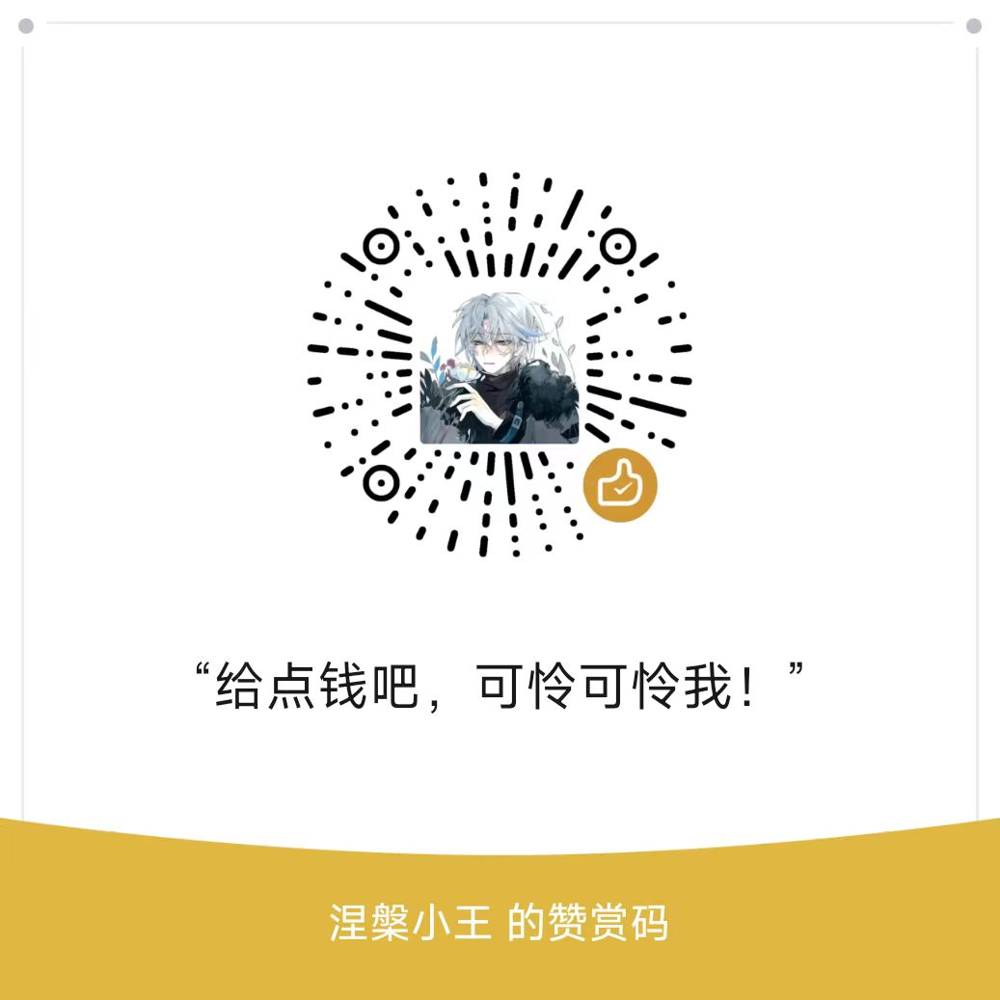

# Self-taught-undergraduate-degree-tutorial
# 自考本科公共课程资料及笔记

> 本仓库会长期更新自考本科公共理论课，以及课程资料寻找方法
> This repository will be updated on a long-term basis with self-study undergraduate public theory courses, as well as methods for finding course materials.

## 内容展示：

[开始阅读](课程/马克思基本原理概论/绪论.md)

[English](course/Introduction to Marx's Basic Principles/introduction.md)

## 更新日志：

### v1.0

- 更新《马克思基本原理概论》课件及笔记

## 赞赏
